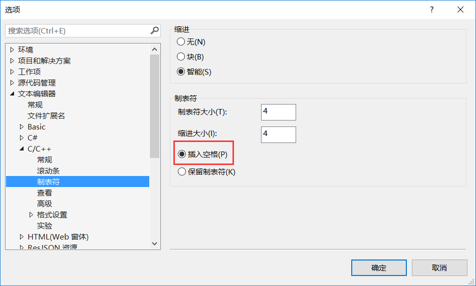

# 代码规范

基本：[C++ code style](https://github.com/chukong/cocos-docs/blob/v3-unified-documentation/manual/framework/native/wiki/cpp-coding-style/zh.md)

## 命名

* **文件**：大驼峰法 `PlayerController.cpp`
* **类名**：和文件名一致 `class PlayerController {}`
* **变量**：小驼峰法 `int myNum = 0;`，私有属性前面加"\_" `int _list[10] = {0};` 
* **方法**： 同变量

## 缩进

采用 4 个空格代替 Tab。需要在 vs 里修改设置。（工具 - 选项 - 文本编辑器 - C/C++ - 制表符）

## 杂项

`for` ,`if`等嵌套不超过 3 层，超过三层考虑重构。

函数长度不宜超过 30 行。